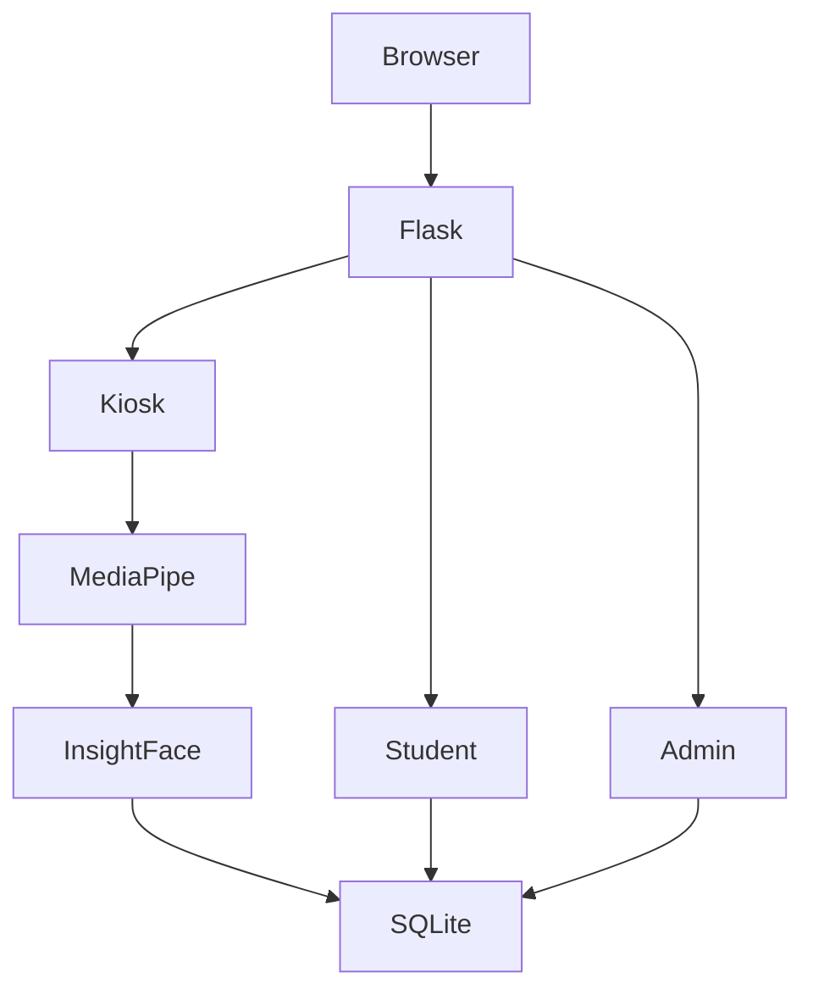

# 🧬 BioAccess

> **AI-Powered Smart Attendance Management Platform** built with **Flask**, **InsightFace**, **MediaPipe**, and **OpenCV**.


BioAccess is a modern face recognition attendance platform featuring **real-time facial recognition**, **anti-spoofing liveness detection**, **role-based authentication**, and a **responsive Flask web interface**. It is designed for educational institutions and organizations requiring secure, contactless attendance.

---

# 📸 Application Preview

> Replace the placeholders below with your screenshots.

## 🏠 Home Portal


## 📷 Kiosk Mode


## 🎓 Student Login


## 📊 Student Dashboard


## 👨‍💼 Admin Login


## 👨‍💼 Admin Dashboard


## 📋 Attendance Reports


---

# ✨ Features

## 🤖 AI
- InsightFace (`buffalo_l`) facial embeddings
- MediaPipe FaceMesh
- Real-time recognition
- Blink detection
- Head-turn detection
- Anti-spoofing
- Duplicate attendance prevention

## 🌐 Web Application
- Flask backend
- HTML, CSS, JavaScript
- Responsive UI
- Dark Mode
- SPA architecture

## 👨‍🎓 Student Portal
- Secure login
- Attendance dashboard
- Calendar view
- Attendance history

## 👨‍💼 Admin Portal
- Register students
- Delete students
- Download CSV reports
- Password reset approvals
- Attendance management

## 📷 Kiosk Mode
- Contactless attendance
- Webcam recognition
- Automatic attendance marking

---

# 🏗️ Architecture



# 🧠 Recognition Pipeline

```text
Camera
 ↓
MediaPipe Face Detection
 ↓
Face Alignment
 ↓
InsightFace Embedding
 ↓
Similarity Matching
 ↓
Blink Detection
 ↓
Head Turn Verification
 ↓
Attendance Logging
```

# 🔐 Authentication

- Admin login
- Student login
- Role-based access control
- Session management
- Local SQLite authentication

# ⚙️ Tech Stack

| Layer | Technology |
|---|---|
| Backend | Flask, Python |
| Frontend | HTML5, CSS3, JavaScript |
| AI | InsightFace |
| Detection | MediaPipe |
| Vision | OpenCV |
| Database | SQLite |
| Export | CSV |
| Container | Docker |

# 📂 Project Structure

```text
BioAccess/
├── classrooms/
├── data/
│   ├── embeddings/
│   └── attendance.db
├── src/
│   ├── static/
│   ├── templates/
│   ├── database.py
│   ├── detector.py
│   ├── encoder.py
│   └── main.py
├── tests/
├── Dockerfile
├── requirements.txt
└── README.md
```

# 🚀 Installation

```bash
git clone https://github.com/UtsavSatane/Face-Recognition-Based-Attendance.git
cd Face-Recognition-Based-Attendance

python -m venv venv

# Windows
venv\Scripts\activate

pip install -r requirements.txt
```

## Requirements

- Python 3.11+
- Webcam
- CPU
- Visual C++ Build Tools (Windows)

# ▶️ Run

```bash
python src/main.py
```

Open:

```
http://127.0.0.1:6030
```

# 🐳 Docker

> Update the Docker entrypoint from the previous Streamlit configuration to:

```dockerfile
CMD ["python","src/main.py"]
```

Expose port **6030**.

# 📊 Performance

| Metric | Value |
|---|---:|
| Accuracy | ~98% |
| Recognition | 150–250 ms |
| FPS | 25–30 |

# 🧪 Testing

```bash
pytest
```

# 🛣️ Roadmap

- PostgreSQL
- Redis
- Analytics
- REST API
- Docker Compose
- Multi-camera support

# 🤝 Contributing

Fork the repository, create a feature branch, commit your changes, and open a Pull Request.

# 📄 License

MIT License.

# 👨‍💻 Author

**Utsav Satane**

Computer Science Engineering Student  
Python & AI Developer • Full Stack Enthusiast

- GitHub: https://github.com/UtsavSatane

---

⭐ If you like this project, consider starring the repository.
